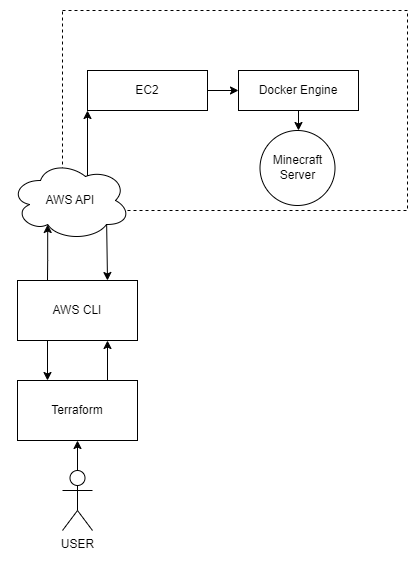

# System Administration (CS 312)
## Course Project Part 2


### What is this?
"This" is a completely automated setup and configuration pipeline for a Minecraft server to fulfill the requirement of "Course Project Part 2".


It utilizes Terraform to construct the infrastructure on AWS and then an EC2 Instance running a Docker container of the server itself.


### Requirements
To utilize this repo it is required that you have installed the `aws-cli` utility from this [link](https://docs.aws.amazon.com/cli/latest/userguide/getting-started-install.html) for your given system.


You will additionally need to install `terraform` from this [link](https://developer.hashicorp.com/terraform/tutorials/aws-get-started/install-cli)


Finally, you will need to configure your AWS credentials in the .aws credentials folder at the root of this repository.


### Process Diagram



### Getting Started
Now that all initial setup is done we can start the server for the first time.
From the root directory of this repository run...


```
cd minecraf-terraform   # Change the directory into the source directory
terraform init          # Initialize the terraform configuration
terraform apply         # Setup and run the infrastructure on AWS
```


Once `terraform apply` is finished running it will output the line
```
public_ip = "xxx.xxx.xxx.xxx"
```

At this point, you can simply go into Minecraft and paste the IP address into your desired connection method!
